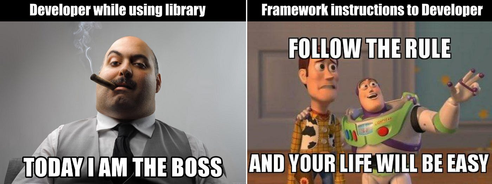
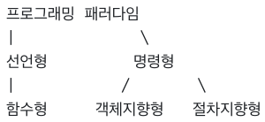

# 디자인 패턴과 프로그래밍 패러다임

## 라이브러리 vs. 프레임워크

라이브러리와 프레임워크의 차이점은 **제어 흐름의 권한**이 어디에 있는가에 있습니다.

### 라이브러리

- 공통으로 사용될 수 있는 특정한 기능들을 모듈화한 것
- 소프트웨어를 개발할 때 사용하는 비휘발성 자원의 모임
  - 특정 기능을 모아둔 코드 및 함수의 집합
- 개발자가 전체적인 흐름을 직접 만들며 사용
- Ex. React.js

### 프레임워크

- 기능 구현에 집중할 수 있도록 필요한 기능을 갖추고 있는 것
- 정해진 프로그램의 틀에 맞게 사용자가 필요한 기능을 입력함
- Ex. Vue.js

  

# 디자인패턴

## 싱글톤 패턴

- 1클래스에 1인스턴스 할당
- Ex. 객체 생성
- 단점
  - TDD 어려움
  - 결합이 강함 -> **의존성 주입**으로 해결

## 팩토리 패턴

- 상-하위 클래스 구분
- 느슨한 결합
- Ex. new Object()

## 전략 패턴

- 정책 패턴이라고도 부름
- 행위를 직접 수정 X -> 전략 내에서 교환
- Ex. 다양한 결제 방식 선택
- 라이브러리: passport (Node.js)

## 옵저버 패턴

- 관찰자가 상태 변화시 변화 알려줌
- Ex. 트위터, MVC 패턴에 이용
- 프록시 객체 구현에 활용 Ex. ref (Java)

## 프록시 패턴과 프록시 서버

- 객체 이전에 흐름 가로채는 것
- Ex. nginx (Node.js), Cloudflare (CDN)
- DDOS 공격 차단
- CORS 에러 프론트엔드에서 이 방식으로 해결 가능

## 이터레이터 패턴

- 다른 구조이더라도 이터레이터로 순회 가능

## 노출모듈 패턴

- 즉시실행함수로 접근제어자(public, private ...) 구현

## MVC 패턴

- View - Controller - Model
- View: UI 요소
- Controller: 메인 로직, 생명주기 관리
- Model: DB, 상수, 변수 등

## MVP 패턴

- View - Presenter - Model

## MVVM 패턴

- View - View Model - Model
- View - View Model: 데이터 바인딩, 커맨드 실행
- Ex. Vue.js

  

# 프로그래밍 패러다임

## 선언형과 함수형 프로그래밍

### 선언형

- _무엇을 풀어내는가?_ 에 집중하는 패러다임
- _프로그램은 함수로 이루어진 것이다._ 라는 명제가 담겨 있음

### 함수형

- 자바스크립트에서는 함수형 프로그래밍을 선호
- 순수함수 + 고차함수로 이루어짐

 

> 

용어 정리

> - 순수함수: 출력이 입력에만 의존하는 것
>   - 고차함수: 함수가 함수를 매개변수로 받아 로직을 생성 가능한 것
>   ❗️ 고차 함수 사용을 위해서는 해당 언어가 일급 객체여야 함
>   ❗️ 일급 객체의 특징
>  1️⃣ 변수나 메서드에 함수 할당 가능
>  2️⃣ 함수 안에 함수를 매개변수로 담을 수 있음
>  3️⃣ 함수가 함수를 반환할 수 있음
> 

  

## 객체지향 프로그래밍

### 특징

- 추상화
- 캡슐화
- 상속성
- 다형성

### 원칙

- 단일 책임 원칙 (SRP)
- 개방-폐쇄 원칙 (OCP)
- 리스코프 치환 원칙 (LSP)
- 인터페이스 분리 원칙 (ISP)
- 의존 역전 원칙 (DIP)
